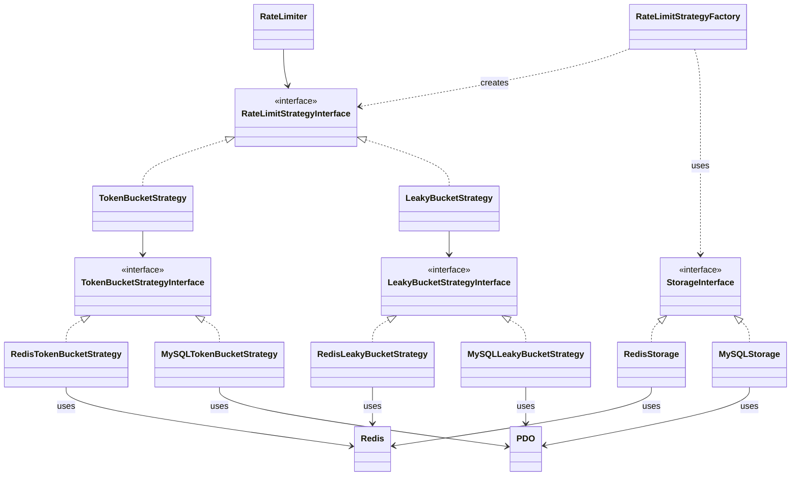

# PHP 限流库

这是一个灵活的 PHP 限流库，支持多种限流策略和存储方式。

## 特性

- 支持令牌桶和漏桶限流策略
- 支持 Redis 和 MySQL 存储
- 可扩展的设计，易于添加新的策略和存储方式

<br><br><br><br>



## 安装

使用 Composer 安装:

composer require your-vendor/rate-limiter


## 基本用法

### 1. 选择存储方式
```
use RateLimiter\Storage\RedisStorage;
use Redis;
$redis = new Redis();
$redis->connect('localhost', 6379);
$storage = new RedisStorage($redis);
```

### 2. 创建限流策略
```
use RateLimiter\RateLimitStrategyFactory;
$strategyFactory = new RateLimitStrategyFactory();
$strategy = $strategyFactory->create('token_bucket', $storage);
```


### 3. 创建 RateLimiter 实例
```
use RateLimiter\RateLimiter;
$rateLimiter = new RateLimiter($strategy);
```

### 4. 使用上面创建的token_bucket限流器
```
$key = 'user:123';
$result = $rateLimiter->isAllowed($key, [
    'maxTokens' => 10,
    'refillRate' => 1,
    'tokensRequested' => 1
]);
if ($result) {
    // 允许请求
} else {
    // 限流，拒绝请求
}
```

### 5. 具体使用请参考example_rate_limiter.php

