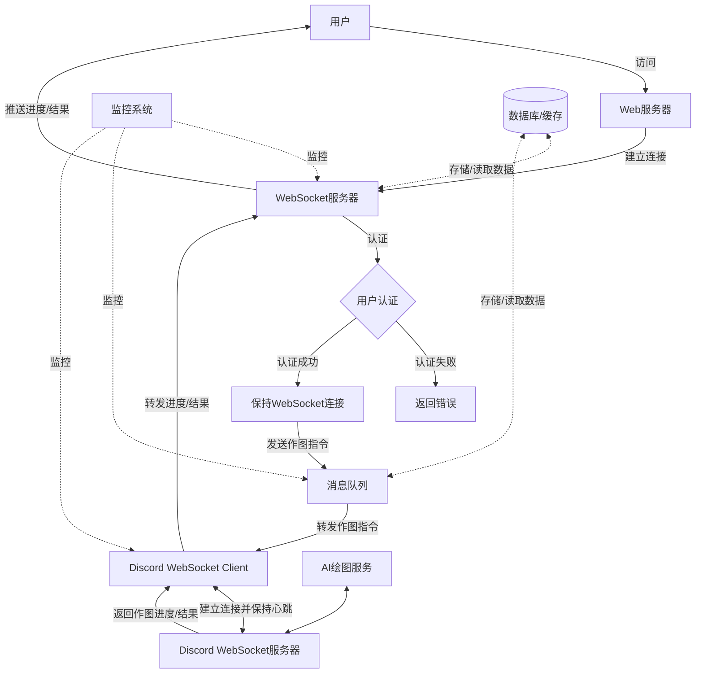

# AI绘图服务系统项目经验

## 项目背景与目标

这个项目是一个基于Discord API的AI绘图服务系统。其主要目标是：

1. 连接Discord服务器，接收用户的绘图请求
2. 将请求发送给AI绘图服务（如Midjourney）
3. 接收AI生成的图片，并返回给用户
4. 管理用户队列和并发请求

### 系统设计规模
- 支持1万活跃用户
- 每个用户每天可制作100张图片
- 高峰期8小时内可处理超过30万次请求

### 项目重要性
1. 为用户提供便捷的AI绘图服务
2. 通过Discord平台扩大用户群
3. 优化资源利用，提高服务效率

## 项目团队组成

1. 项目经理：负责整体规划和协调
2. 后端开发工程师（我的角色）：负责核心逻辑实现
3. 前端开发工程师：负责用户界面开发
4. 测试工程师：负责功能和性能测试
5. 运维工程师：负责系统部署和维护

### 我的主要职责
1. 设计和实现核心业务逻辑
2. 对接Discord API和AI绘图服务
3. 优化系统性能和并发处理能力

## 关键技术挑战

如何高效地管理大量并发的用户请求，同时保持用户端到服务端到Discord服务器的稳定连接，并确保系统能够公平地为所有用户提供服务。

### 挑战的复杂性
1. 需要同时处理多个Discord用户的WebSocket连接
2. 要管理大量并发的绘图请求，避免系统过载
3. 需要保持与Discord服务器的长连接，及时处理各种事件
4. 系统要能够优雅地处理网络异常和重连
5. 需要实现公平的资源分配，避免少数用户占用过多资源

## 问题分析与解决方案

### 1. 使用协程技术

使用PHP的Swoole扩展，利用其协程特性来处理并发连接。

```
Co\run(function () use ($channel) {
foreach ($this->discordUsers as $user) {
go(function () use ($channel, $user) {
$client = new DiscordWebSocketClient($user);
    // ...
});
}
    // ...
});
```


### 2. 实现连接池

设计连接池管理Discord客户端，提高系统稳定性和效率。
```
php
class DiscordWebSocketManager
{
public $clients = [];
public $validDiscord;
public function construct(array $discordUsers)
{
$this->validDiscord = new Channel(500); // 增加到500以支持更多并发连接
// ...
}
public function validDiscordAdd($client, $num)
{
for ($i = 0; $i < $num; $i++) {
$this->validDiscord->push($client);
}
}
}
```

### 3. 实现断线重连机制
```
private function reconnect()
{
Co::sleep(5);
$this->connectToWebSocket();
}
```

### 4. 使用优化的消息队列
```
public function loopMsg() {
while (true) {
$batchSize = min($this->requestQueue->length(), 50);
for ($i = 0; $i < $batchSize; $i++) {
$request = $this->requestQueue->pop();
$this->processRequest($request);
}
Coroutine::sleep(1);
}
}
```

### 5. 实现心跳机制
```
private function startHeartbeat()
{
$this->heartbeatCoroutine = Co::create(function () {
while (!$this->stopHeartbeat) {
$this->client->push(json_encode(['op' => 1, 'd' => null]));
Co::sleep($this->heartbeatInterval / 1000);
}
});
}
```

### 6. 实现智能排队系统
```
public function queueRequest($user, $request) {
$queuePosition = $this->calculateQueuePosition($user);
$this->requestQueue->push(['user' => $user, 'request' => $request, 'position' => $queuePosition]);
}
```

### 7. 添加限流机制
```
public function canMakeRequest($user) {
$dailyCount = $this->getDailyRequestCount($user);
return $dailyCount < 100;
}

```

### 8. 实现细粒度的系统监控

```
public function monitorSystemLoad() {
go(function () {
while (true) {
$currentLoad = $this->getCurrentSystemLoad();
$this->adjustProcessingRate($currentLoad);
Coroutine::sleep(5);
}
});
}
```

## 系统架构图




## 结论

通过协程、连接池、断线重连、优化的消息队列、智能排队、限流机制等技术的综合运用，我们成功构建了一个高效、稳定、可扩展的AI绘图服务系统，能够支持1万活跃用户，每天每人制作100张图片的需求，并在8小时高峰期内处理超过30万次请求。这个解决方案不仅提高了系统的并发处理能力，还增强了系统的稳定性、可靠性和公平性。
